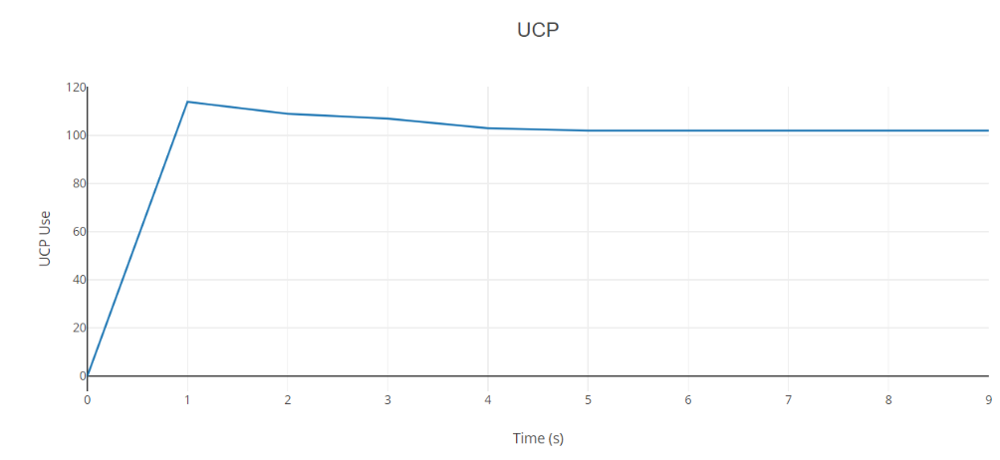
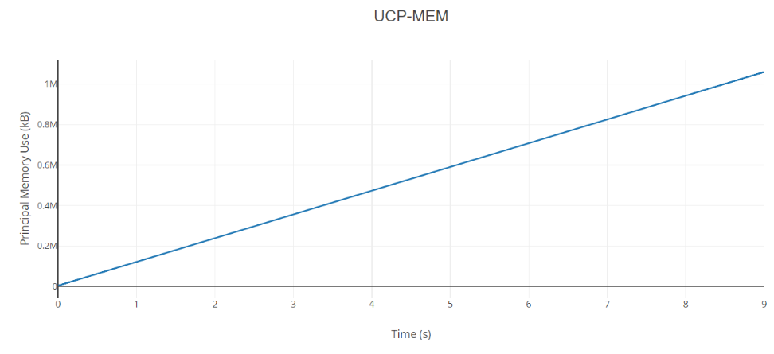

**Trabalho AB2 - Introdução à Computação**

**Criação de Código para Monitoramento do SO(Relatório)**

**Identificação:**

**Discente 1**

- **Nome:** _Alther Jaime da Silva Lago_
- **Matrícula:** _18110599_
- **Distribuição da nota (%):** _33,3 % (⅓)_

**Discente 2**

- **Nome:** _Gabriel Alves Pereira_
- **Matrícula:** _18110465_
- **Distribuição da nota (%):** _33,3 % (⅓)_

**Discente 3**

- **Nome:** _Lucas A. Lisboa_
- **Matrícula:** _18110495_
- **Distribuição da nota (%):** _33,3% (⅓)_

**Introdução:**

Este é um relatório solicitado para a matéria de _Introdução à Computação_ que envolve a utilização intensa de memória e CPU por meio de processos da mesma a fim de compreender a utilização de recursos. Para a produção do código requisitado utilizamos o material disponibilizado pelo professor André Lages, bem como de seu monitor Caio Nunes, a confecção do programa foi feito na linguagem C centrada principalmente na função _Fork_, que possibilita a duplicação de um mesmo processo permitindo que os dois executem diferentes propósitos e alternadamente através do _pseudoparalelismo,_ o que possibilitou a leitura de recursos simultâneamente as demais funções apresentadas pelo programa.

**Resultados:**

**Gráfico 1:** Uso da CPU. 

**Gráfico 2:** Uso da memória principal.

 

**Discussão:**

**Geral:**

Para chegar aos resultados obtidos foram utilizadas duas funcionalidades primárias, cpu e cpu-mem, a primeira se utiliza do chamado &quot;laço infinito&quot;, que repete a função até que o programa pare, e a segunda inicia o comando de alocação de memória (malloc), que quando inserida em um laço infinito resulta em uma intensa utilização da memória.

Ao iniciar o programa sem nenhuma dessas utilizações é possível observar que o processo apenas aloca a pouca memória necessária para seu funcionamento, e durante o resto da execução nenhum recurso de processamento ou memória é utilizado, isso porque a este ponto o programa não está executando mais nenhuma funcionalidade com exceção da impressão na tela.

**Utilização intensa da UCP:**

No entanto, ao utilizarmos o programa com a funcionalidade &quot;_CPU&quot;,_ o processo iniciará um &quot;laço infinito&quot;, e assim como esperado os dados imprimidos demonstram um intenso uso da Unidade de Processamento, o motivo de tal resultado se deve ao fato que ao não colocarmos nenhuma condição de parada à função de repetição o programa ficará executando ela infinitamente até que todo o processo seja encerrado, o que realmente acontece é que um computador tem uma capacidade de processamento tão rápido que essa função é executada repetidamente em uma grande quantidade a cada segundo, o que acaba por preencher toda sua capacidade de processamento deixando o núcleo de processamento em seu uso máximo, motivo pelo qual a utilização chega em até 100% ou mais (a depender da quantidade de núcleos da máquina).

**Utilização intensa da UCP e memória:**

Inicializado ao utilizar a funcionalidade &quot;_CPU-MEM&quot;_ do programa, nessa ocasião o processo se utiliza de um &quot;laço infinito&quot; da mesma forma que o anterior, com exceção de que além disso a função malloc é utilizada a fim de provocar a alocação de memória principal para a execução do programa, quando isso é adicionado dentro do laço ocorre uma alocação constante que resulta em um uso extremo da chamada Memória Ram, indicado pelos gráfico 2 e pela própria impressão do programa que consta um crescimento exponencial no uso de memória.

Um grande desafio encontrado nessa funcionalidade é que devido ao &quot;laço infinito&quot;, a alocação de memória ocorre tantas vezes em tamanha velocidade que a máquina acaba não tendo recurso o suficiente e trava, como medida foi usado um limitador através que só permite a alocação de memória &quot;x&quot; vezes em um determinado período de tempo, ainda mantendo o extremo uso de UCP e Memória Principal mas moderado para que a máquina suporte o programa.

Vale salientar que: Um dos integrante conseguiu executar em seu computador essa execução alocando 4,5 GB de memória, e não obteve nenhum problema com relação ao travamento da máquina. No entanto, devido a fins de maior compatibilidade com outros dispositivos o limite de alocação de memória foi reduzido para algo aproximado de 1,6 GB.

**Conclusão:**

Como visto, o código é funcional para analisar o funcionamento do processador, observando seu uso de memória e eficiência operacional, além de fornecer uma visão de como age o Sistema Operacional em seu gerenciamento de tarefas e durante sua confecção demonstrar aos discentes o funcionamento de um sistema de &quot;paralelismo&quot;.
